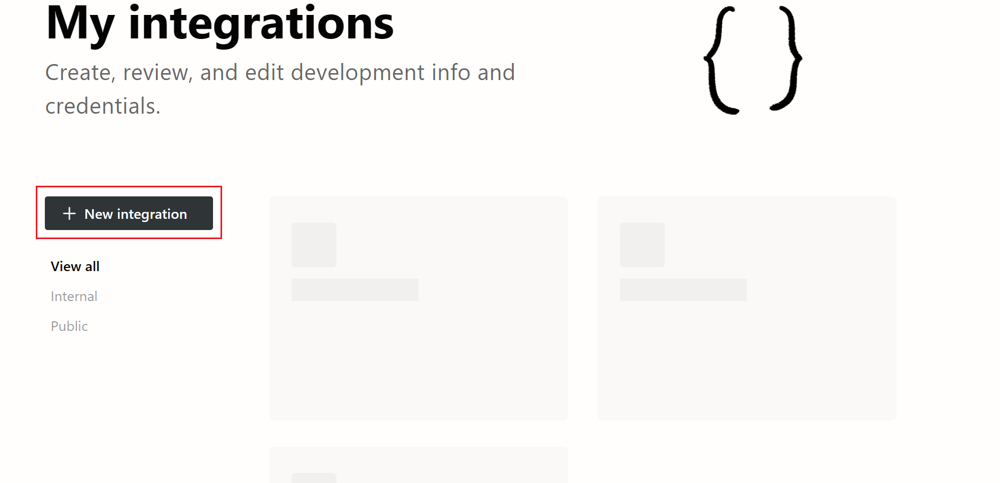
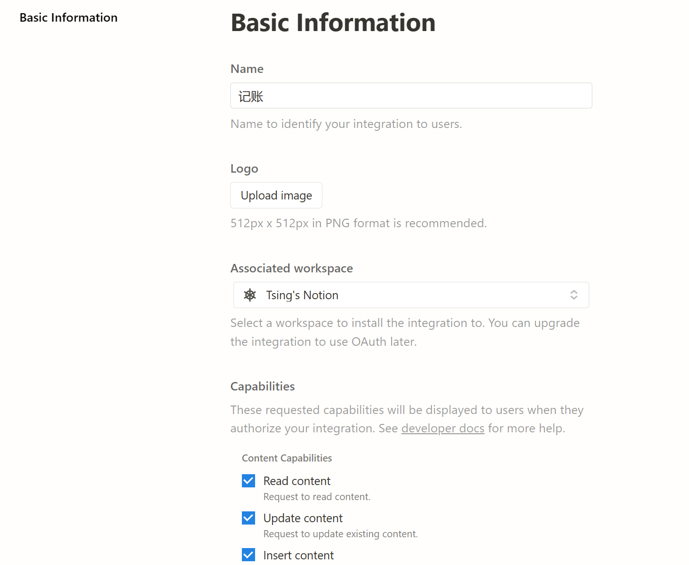
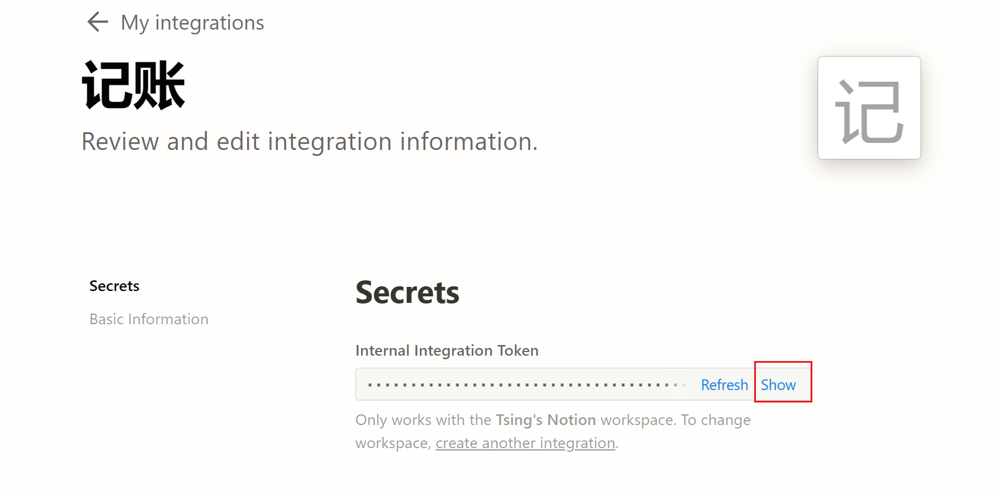
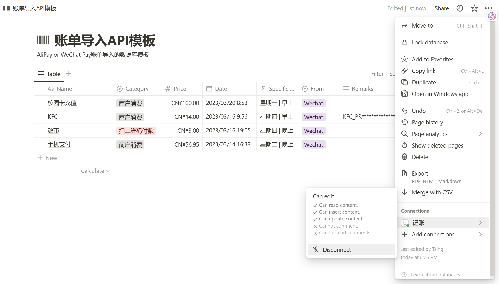

# Alipay_to_Notion

# Please note

支付宝和微信的账单导入已经完成合并，并且用类的方式重新写了一遍，所以放在[WeChatPay_to_Notion](https://github.com/tsinglinrain/WechatPay_to_Notion/tree/main)项目中，请移步该项目。

本项目仅保存旧版的代码写法，并且不再更新。

The bill import of Alipay and WeChat has been merged and rewritten in the form of classes, so it is placed in the [WeChatPay_to_Notion](https://github.com/tsinglinrain/WechatPay_to_Notion/tree/main) project. Please move to this project.

This project only saves the old version of the code and will no longer be updated.

Transfer Alipay bills to Notion, does not use Alipay official API<br>
将支付宝账单转入Notion，注意没有使用支付宝官方API<br>

[中文](https://github.com/tsinglinrain/Alipay_to_Notion/blob/main/README_zh.md) | [English](https://github.com/tsinglinrain/Alipay_to_Notion/blob/main/README.md)

This is another attempt at using the Notion API, which is still a **learning project**. There may still be some issues with the code. 

In addition, I have also created another project called [tsinglinrain/WechatPay_to_Notion](https://github.com/tsinglinrain/WechatPay_to_Notion) for importing WeChat payment bills into Notion. The code between the two projects is almost identical, but separating them is beneficial for bill processing.

I am currently using this project myself and using related templates to manage my expenses in Notion.

# Other Notes

I couldn't understand the official API documentation of Alipay.
[Querying the download link for account reconciliation - Alipay Documentation Center (alipay.com)](https://opendocs.alipay.com/apis/api_15/alipay.data.dataservice.bill.downloadurl.query)

Here, I chose to export the bill first, and then use the Python language and the API interface provided by Notion to request it. Finally, the content is sent to the Notion database.

The inspiration for this project comes from an article on Sspai, [here](https://sspai.com/post/66658), but the author did not provide the complete code.

# Instructions

## 1. Notion API Application

### 1.1 Visit [My integrations | Notion Developers](https://www.notion.so/my-integrations)



### 1.2 Click `New integration`

Simply fill in the `Name`, select the `Associated workspace`, and scroll down to find `Submit` and click to submit.



After clicking `show`, click `copy` and keep it for later use. If you are using a Windows system, you can view the clipboard contents by pressing `win`+`v` on the keyboard.



## 2. Notion Database

### 2.1 Create a Database

You can refer to this [template](https://tsinglin.notion.site/tsinglin/68951a1caaba487a884cafcd5086810c?v=3d0c405e7cae405599aed2fe0f5233cc) by making a copy of it.

Please note that if you are not familiar with the official request mode, please do not edit this template. If you need to customize it, please refer to [Introduction (notion.com)](https://developers.notion.com/reference/intro) and make relevant modifications to the Python code.

### 2.2 Import Integration

As shown in the figure below, click `...`, then click `Add connections`, and find the `integration` you previously set up, which is named `记账` here.


After clicking `confirm`, it should look like the following figure. 



### 2.3 Copy `database id`

In the browser, find your database and observe the URL. The URL should look like this:

https://www.notion.so/tsinglin/68151a1caaca488a884cafcd5086810c?v=3d0c405e7cae406599eed2fe3f9233dc

Copy the content between `tsinglin/` and `?`, which is the `database id`.

## 3. Exporting Alipay bill

To export your Alipay bill...

You will receive an email with a compressed file and a password which is your ID to extract it. The file inside should be in CSV format.

## 4. Setting up the Python code

### 4.1 Downloading the project files

You can either download all files in this project using `git`, or simply download the compressed file and extract it.

### 4.2 Filling in the database ID and token

Please make a copy of `config.yaml` and rename it as `config_private.yaml`. Then, fill in the following information:

```yaml
# 请将此config.yaml复制并重命名为config_private.yaml
database_id: "aaa121************"   # 数据库ID, 要填进去哦
token: "secret_Wa***********" # token, 记得自己填写
```

### 3.3 Renovation

Copy the CSV file of Alipay bills into this folder and rename this CSV file to `Alipay_raw.csv`.

explain the reason:

1. The position of the code in the code is the relative path. The Alipay bill file must be under the same folder as the above file.

2. The specified file name in the code is `Alipay_raw.csv`, which must be renamed Alipay bill files

### 3.4 Running program

Run the `main.py`.

### 3.5 Observation running results

Generally, a success appears.

A failure appears, it is necessary to check separately, and it has not yet returned which line fails to return, and then modify it later .
